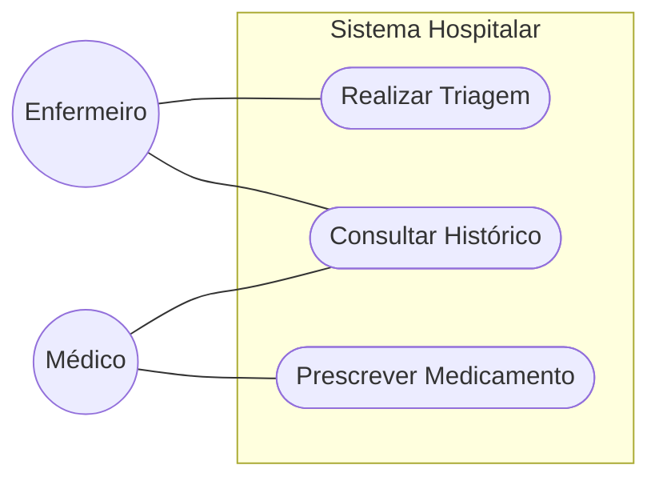

# Modelagem de Casos de Uso

## 1. Diagrama de Casos de Uso
*(Inserir imagem ou Mermaid)*
*(Está em processo de criação)*

## 2. Especificação (Exemplo)
### UC001 - Triagem
* **Ator**: Enfermeiro.
* **Fluxo**: Selecionar paciente -> Inserir Sinais Vitais -> Calcular Manchester.

#### [CARE-UC001] Implementação da Triagem
* **Context**: Paciente identificado e autenticado.
* **Action**: Implementar lógica de cálculo do Protocolo de Manchester baseada em Sinais Vitais.
* **Result**: Classificação de risco persistida e enviada para o painel médico.
* **Evaluation**: Teste unitário deve validar 5 cenários de cores (Vermelho a Azul) com 100% de acurácia.
