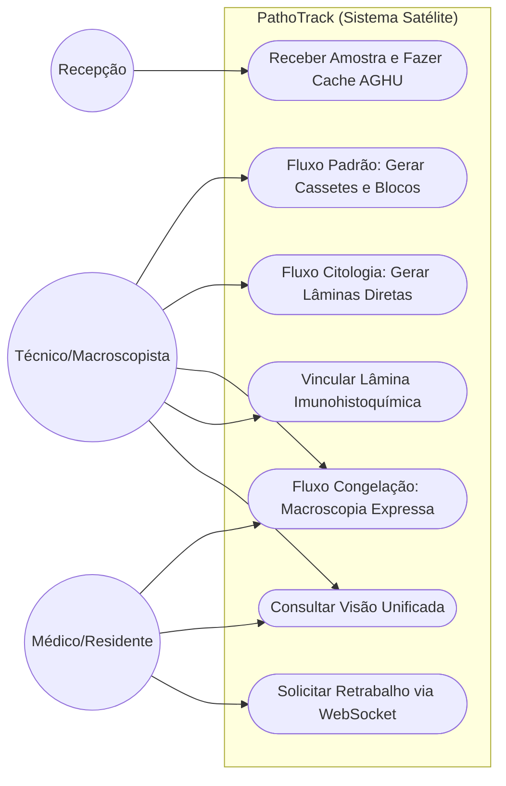

# Modelagem de Casos de Uso

## 1. Diagrama de Casos de Uso (Múltiplas Rotinas)

## 2. Especificações de Casos de Uso Críticos
[CARE-UC003] Fluxo de Citologia Geral (Meio Líquido)

    * Context: Recepção envia frasco com líquido. Não haverá geração de blocos de parafina.

    * Action: Técnico seleciona "Registro de Lâminas (Citologia Líquido)" e bipa o Frasco.

    * Result: O sistema gera identificadores (ZPL) para Lâminas vinculadas àquele Frasco, suprimindo exigências de Cassete e Bloco.

    * Evaluation: Ao ler a lâmina gerada, a Visão Unificada mostra linhagem: Frasco -> Lâmina.

[CARE-UC004] Biópsia por Congelação (Urgência)

    * Context: Paciente no centro cirúrgico aguarda resposta imediata do patologista.

    * Action: Sistema prioriza o frasco. Médico faz macroscopia, técnico cora a lâmina e laudo é liberado via status "Congelação Finalizada".

    * Result: Após a finalização expressa, o sistema re-insere a peça restante na fila de "Macroscopia Padrão" para processamento histopatológico
    convencional.

    * Evaluation: A peça deve possuir duplo rastreio de Turnaround Time (TAT Expresso e TAT Padrão).