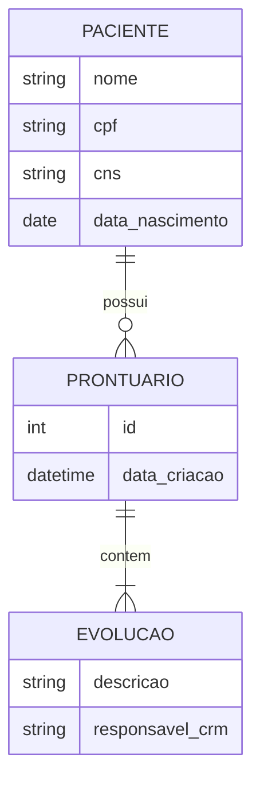

# Modelo de Dados e Dicionário

## 1. Modelo Entidade-Relacionamento

## 2. Dicionário de Dados
* Tabela PACIENTES, PRONTUARIOS, etc.

## 3. Regras de Integridade
* Logs obrigatórios e proibição de exclusão física.
