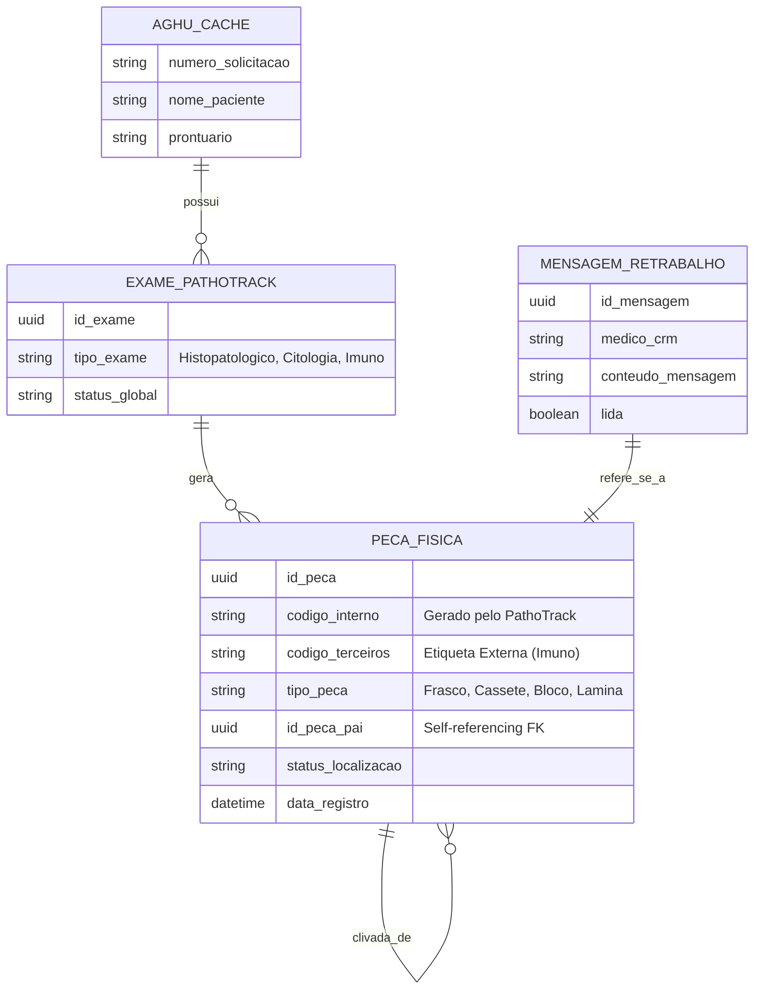

# Modelo de Dados e Dicionário

## 1. Modelo Entidade-Relacionamento Flexível (Polimorfismo)
A arquitetura de dados suporta fluxos variáveis (Histopatológico, Citologia, Congelação e Imunohistoquímica) utilizando uma tabela auto-referenciada para permitir pulos de etapas físicas.

## 2. Regras de Integridade e Vantagens Arquiteturais

    * Self-Referencing Table (PECA_FISICA): Evita rigidez.

        * Histopatológico: Lâmina (pai: Bloco) -> Bloco (pai: Cassete) -> Cassete (pai: Frasco).

        * Citologia Líquida: Lâmina (pai: Frasco) -> Sistema aceita a relação.

        * Citologia Cérvico-Vaginal: Lâmina (pai: NULL, ligada direto ao exame).

    * Código de Terceiros: A coluna codigo_terceiros permite salvar a etiqueta gerada por equipamentos automatizados de Imunohistoquímica.

    * Imutabilidade: A exclusão física (DELETE) é proibida. Uso obrigatório de Soft Delete (status "Descartada").